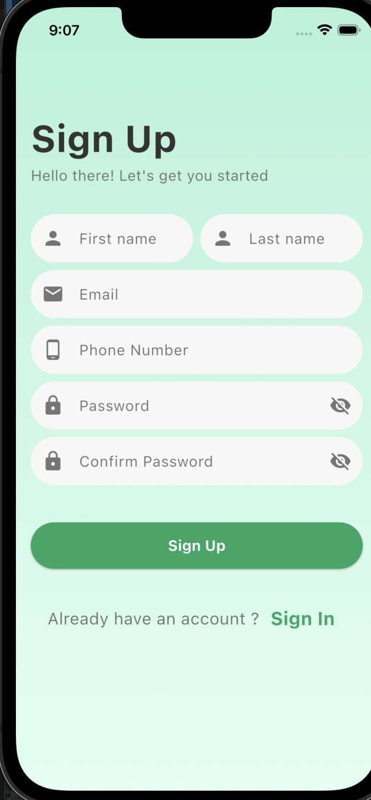
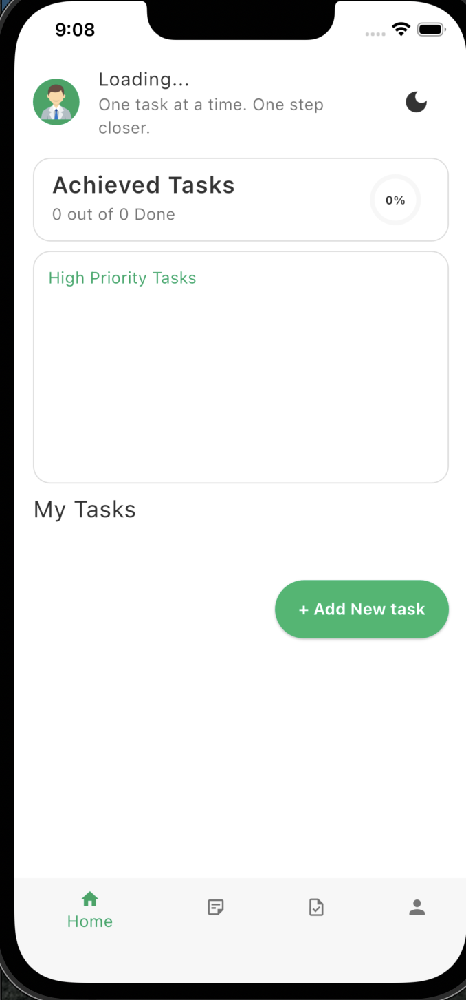
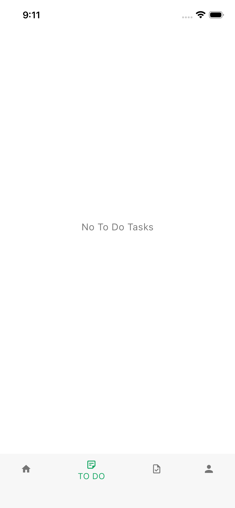
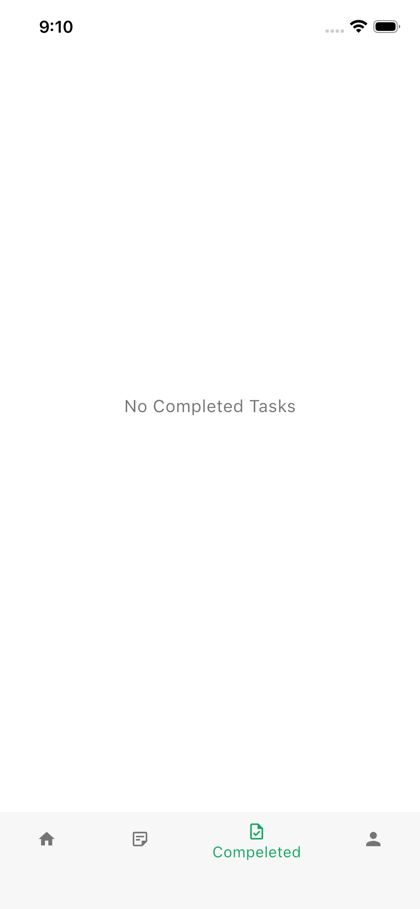
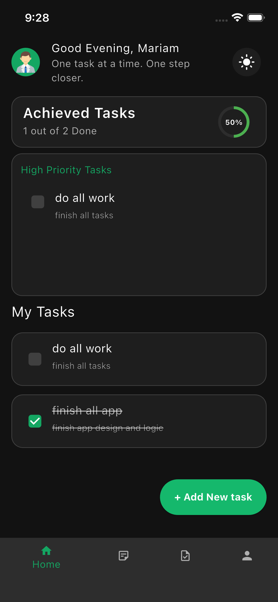
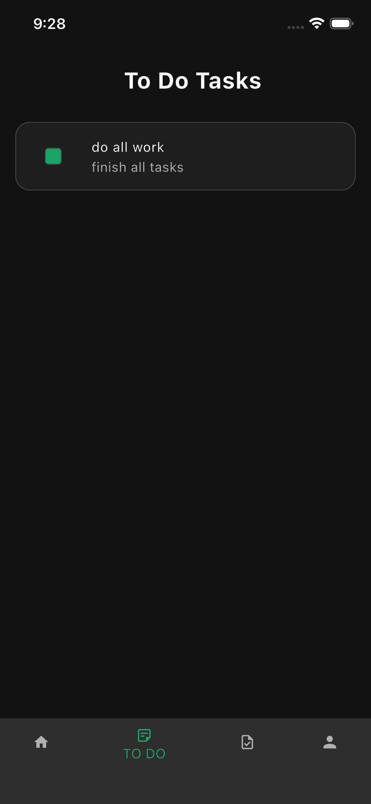
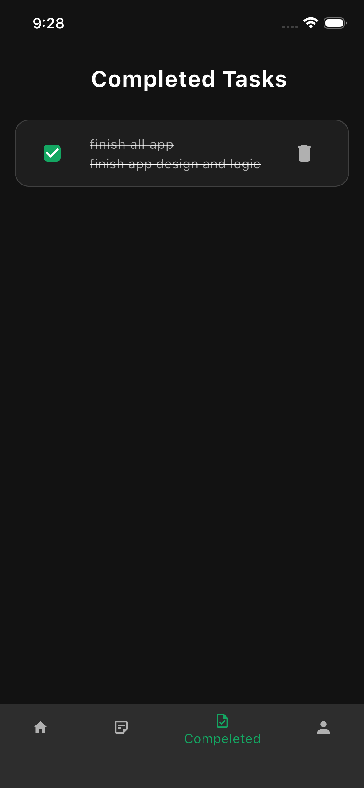

# 📱 ToDo Task Manager

<div align="center">
  
  
  
  
  
</div>

<div align="center">
  
</div>

## 🎯 Overview

**Tasky** is a beautiful and intuitive task management application built with Flutter. Manage your daily tasks efficiently with a clean interface, dark/light mode support, and offline data persistence.

## ✨ Features

### 📋 Core Features

- ✅ **User Authentication** - Secure login/signup with local storage
- 📝 **Task Management** - Create, edit, delete, and mark tasks as complete
- 🏷️ **Priority System** - Mark tasks as high priority
- 📊 **Progress Tracking** - Visual progress indicator for completed tasks
- 🔄 **Offline Support** - Works completely offline using Hive database
- 🎨 **Beautiful UI** - Modern and intuitive Material Design interface

### 🎨 Theme & Customization

- 🌓 **Dark/Light Mode** - Full theme support with automatic switching
- 🎨 **Custom Theme** - Primary green color scheme (#14A662)
- 👤 **User Profile** - Edit personal information and profile picture
- 📸 **Photo Upload** - Upload profile pictures from gallery or camera

### 📱 Platform Support

- 📱 **Android** - Full support with adaptive icons
- 🍎 **iOS** - Native iOS experience
- 💻 **Responsive Design** - Adapts to different screen sizes

## 🖼️ Screenshots

|  |                    |  |  (assets/images/home2.png) |  |     |  |     |  |
| :---------------------------------------: | :----------------: | :------------------------------------------: | ---------------------------------------------------------------- | --------------------------------------- | --- | -------------------------------------------------------- | --- | -------------------------------------------- |
|                 **Login**                 | **Home Dashboard** |                **Task List**                 |

|  |  |  |  | [Add Task](assets/images/addTask.png) |
| :-----------------------------------: | :------------------------------------: | :------------------------------: | ------------------------------------------------- | ------------------------------------- |
|             **Dark Mode**             |

## 🚀 Getting Started

### Prerequisites

- Flutter SDK (>= 3.16.0)
- Dart (>= 3.2.0)
- Android Studio / VS Code
- iOS: macOS with Xcode (for iOS builds)

### Installation

1. **Clone the repository**

   ```bash
   git clone https://github.com/yourusername/todo-task-manager.git
   cd todo-task-manager
   ```

2. **Install dependencies**

   ```bash
   flutter pub get
   ```

3. **Run the app**
   ```bash
   flutter run
   ```

### Build Instructions

#### Android

```bash
flutter build apk --release
# or for app bundle
flutter build appbundle --release
```

#### iOS

```bash
flutter build ios --release
# Open in Xcode for distribution
open ios/Runner.xcworkspace
```

## 📁 Project Structure

```
lib/
├── core/
│   ├── cache/              # Local storage implementation
│   ├── constants/          # App constants and themes
│   ├── theme/              # Theme provider and colors
│   └── widgets/            # Reusable UI components
├── features/
│   ├── auth/               # Authentication feature
│   │   ├── data/           # User models
│   │   └── presentation/   # UI screens
│   └── tasks/              # Tasks feature
│       ├── data/           # Task models (Hive)
│       └── presentation/   # Task management UI
└── main.dart              # App entry point
```

## 🛠️ Technologies Used

### Core Frameworks

- **Flutter** - UI toolkit for building natively compiled applications
- **Dart** - Programming language optimized for UI

### State Management

- **Provider** - State management for theme and user data
- **ValueNotifier** - Reactive state management

### Data Persistence

- **Hive** - Lightweight and fast NoSQL database for tasks
- **Shared Preferences** - For storing user preferences and auth state

### UI & Design

- **Material Design 3** - Modern design system
- **Percent Indicator** - Progress visualization
- **Image Picker** - Profile picture upload

### Architecture

- **Clean Architecture** - Separation of concerns
- **Repository Pattern** - Data abstraction layer
- **Dependency Injection** - Loose coupling

## 🔧 Configuration

### Environment Variables

Create a `.env` file in the root directory:

```env
# App Configuration
APP_NAME=Tasky
PRIMARY_COLOR=#14A662
SECONDARY_COLOR=#15B86C

# API Configuration (for future enhancements)
API_BASE_URL=https://api.example.com
API_KEY=your_api_key_here
```

### Platform Setup

#### Android

- Minimum SDK: 21
- Target SDK: 34
- Permissions: Camera, Storage, Internet

#### iOS

- Minimum iOS: 13.0
- Permissions: Camera, Photo Library

## 📦 Dependencies

### Main Dependencies

```yaml
dependencies:
  flutter:
    sdk: flutter

  # State Management
  provider: ^6.1.2

  # Database
  hive: ^2.2.3
  hive_flutter: ^1.1.0
  shared_preferences: ^2.2.2

  # UI Components
  percent_indicator: ^4.2.3
  image_picker: ^1.0.7

  # Utilities
  path_provider: ^2.1.3
  path: ^1.8.3
```

### Dev Dependencies

```yaml
dev_dependencies:
  flutter_test:
    sdk: flutter
  hive_generator: ^1.1.3
  build_runner: ^2.4.7
  flutter_launcher_icons: ^0.13.1
```

## 🧪 Testing

### Unit Tests

```bash
flutter test
```

### Widget Tests

```bash
flutter test test/widget_test.dart
```

### Integration Tests

```bash
flutter test integration_test/app_test.dart
```

## 📱 App Features in Detail

### Authentication System

- Secure user registration and login
- Local authentication with SharedPreferences
- Automatic session management
- Profile data persistence

### Task Management

- **CRUD Operations**: Full Create, Read, Update, Delete functionality
- **Priority Filtering**: Filter tasks by priority level
- **Completion Tracking**: Mark tasks as done with visual feedback
- **Progress Analytics**: Visual percentage of completed tasks

### User Experience

- **Dark/Light Theme**: Automatic theme switching based on system or manual selection
- **Greeting Messages**: Dynamic greetings based on time of day
- **Profile Management**: Edit personal details and upload profile pictures
- **Intuitive Navigation**: Bottom navigation bar for easy access

### Performance

- **Offline First**: All data stored locally for instant access
- **Fast Loading**: Optimized database queries with Hive
- **Smooth Animations**: Custom fade animations for transitions
- **Efficient State Management**: Minimal rebuilds with Provider

## 🔄 State Management Architecture

```dart
// Example of the state management flow
AppState
├── ThemeProvider (Manages dark/light mode)
├── UserProvider (Manages user data and auth)
└── TaskProvider (Manages tasks - for future enhancement)

// Data Flow
UI → Provider → Repository → Data Source (Hive/SharedPreferences)
```

## 🎨 Customization Guide

### Changing Colors

Edit `lib/core/theme/app_colors.dart`:

```dart
static const Color primary = Color(0xFF14A662); // Change to your preferred color
static const Color primaryLight = Color(0xFF15B86C);
```

### Adding New Features

1. Create feature folder under `lib/features/`
2. Follow the established pattern (data/domain/presentation)
3. Add dependencies in `pubspec.yaml`
4. Register providers in `main.dart`

## 📈 Future Enhancements

### Planned Features

- [ ] **Cloud Sync** - Backup tasks to cloud
- [ ] **Categories** - Organize tasks by categories
- [ ] **Reminders** - Push notifications for tasks
- [ ] **Collaboration** - Share tasks with others
- [ ] **Analytics** - Detailed task completion statistics
- [ ] **Export/Import** - Backup tasks to file
- [ ] **Voice Input** - Add tasks using voice commands
- [ ] **Widget Support** - Home screen widgets

### Technical Improvements

- [ ] **Testing Suite** - Comprehensive unit and integration tests
- [ ] **CI/CD Pipeline** - Automated build and deployment
- [ ] **Localization** - Multi-language support
- [ ] **Accessibility** - Improved accessibility features
- [ ] **Performance** - Further optimization for large task lists

### Contribution Guidelines

- Follow the existing code style
- Add tests for new features
- Update documentation as needed
- Ensure all tests pass before submitting

## 📞 Support

Need help? Here's how to reach us:

- **Email**: mariamfawzy110@gmail.com

## 🌟 Show Your Support

If you find this project useful, please give it a ⭐️ on GitHub!

---

## 📱 Download

Get the app from:

- [Google Play Store] (Coming Soon)
- [Apple App Store] (Coming Soon)

---

**Tasky** - Your personal productivity companion. Stay organized, stay productive! 🚀
